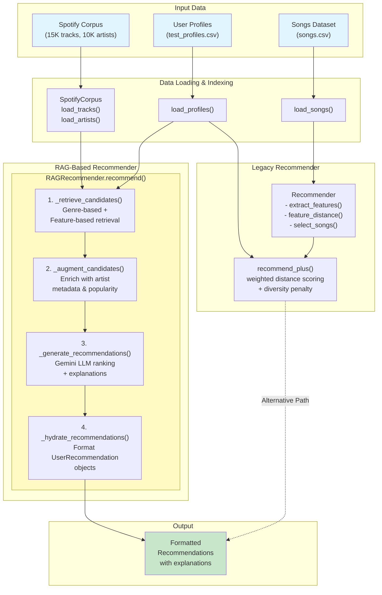

# 🎵 Music Recommender Simulation 2.0

## Project Summary

This app is an improvement over the original music recommender. The original music recommender computed recommendations by calculating weighted distances between a user's preference profile and each song in a small dataset, ranking songs by how closely their features aligned with the user's stated preferences

This extension uses RAG over a much larger corpus of data from Spotify (15K songs and 10K artists) to allow for better recommendation, and also provide a human readable explanations of why it made a recommendation. It is able to leverage multi-genre artists to allow recommendation of closely related genres without users explicitly declaring them as a preference.

---

## How The System Works

Songs have the features: *energy, valence, danceability, acousticness, tempo, speechiness, instrumentalness*. Users also have preferences for each. The recommender selects songs that are in alignment with user preferences.  

Pre-filtering is done on two bases: genre and song features. A temperature setting determines how broadly to search for adjacent genres and variability in song features from user preferences.  
The filtered data is then structured for ingestion, and presented along with the prompt which includes user preference and temperature.

Mermaid diagram also includes old implementation of 

---

## Getting Started

### Setup

1. Create a virtual environment (optional but recommended):

   ```bash
   python -m venv .venv
   source .venv/bin/activate      # Mac or Linux
   .venv\Scripts\activate         # Windows

2. Install dependencies

    ```bash
    pip install -r requirements.txt
    ```

3. Run the app:

    ```bash
    python -m src.main
    ```

### Running Tests

Run the starter tests with:

```bash
pytest
```

---

## Sample Outputs

Paste a sample of your recommender's output here as a text block so a reader can see what it produces:

```
============================================================
USER PROFILE
============================================================
  name            : Metalhead
  genre           : metal
  mood            : aggressive
  energy          : 0.88
  tempo           : (any)
  valence         : 0.42
  danceability    : 0.65
  acousticness    : 0.12
  instrumentalness: 0.15
  speechiness     : 0.06

tracks by genre: 73
tracks by features: 14 at 0.1 limit
querying gemini at T=0.3...

================================================================================
Top recommendations (RAG-powered from Spotify corpus):
================================================================================

1. RENEGADE MASTER by Unknown
   Genres: 
   Popularity: unknown
   ? Matches high energy and danceability targets perfectly.

2. My Curse by killswitch engage (established (1M+))
   Genres: alternative metal, boston metal, melodic metalcore
   Popularity: established (1M+)
   ? Aligns closely with the user's high energy and low valence profile.

3. Enter Sandman by metallica (major (5M+))
   Genres: hard rock, metal, old school thrash
   Popularity: major (5M+)
   ? Strong energy alignment with moderate acoustic and instrumental scores.

4. Rainbow In The Dark by dio (established (1M+))
   Genres: album rock, alternative metal, glam metal
   Popularity: established (1M+)
   ? High energy score closely mirrors the user's primary preference.

5. I Remember You by skid row (established (1M+))
   Genres: album rock, glam metal, hard rock
   Popularity: established (1M+)
   ? Provides acoustic and instrumental scores near user preferences.

============================================================
USER PROFILE
============================================================
  name            : Classical Purist
  genre           : classical
  mood            : melancholy
  energy          : 0.35
  tempo           : (any)
  valence         : 0.45
  danceability    : 0.30
  acousticness    : 0.82
  instrumentalness: 0.85
  speechiness     : 0.06

n tracks by genre: 81
n tracks by features: 2 at 0.1 limit
querying gemini at T=0.3...

================================================================================
Top recommendations (RAG-powered from Spotify corpus):
================================================================================

1. Bereden väg för Herran (Psalm 103) by Unknown
   Genres: 
   Popularity: unknown
   ? Matches Energy, Valence, and Instrumental metrics perfectly.

2. Ouverture nach Französischer Art, BWV 831a (Arr. for Chamber Ensemble by Leonard Schick & Marsyas Baroque) by johann sebastian bach (major (5M+))
   Genres: baroque, classical, early music
   Popularity: major (5M+)
   ? Strong alignment with Energy, Valence, and Danceability preferences.

3. Stimmungsbilder Op. 9, TrV 128: II. An einsamer Quelle by richard strauss (rising (100K+))
   Genres: classical, german romanticism, post-romantic era
   Popularity: rising (100K+)
   ? High instrumental score aligns closely with user interest profile.

4. Études: No. 6 by philip glass (established (1M+))
   Genres: american contemporary classical, classical, compositional ambient
   Popularity: established (1M+)
   ? High instrumental score matches preference despite lower valence.

5. Giulio Cesare in Egitto, HWV 17, Act III Scene 1: Flow, my tears (Cleopatra) [Sung in English] by george frideric handel (established (1M+))
   Genres: baroque, classical, early music
   Popularity: established (1M+)
   ? High acoustic score matches user's preference for acoustic intensity.

============================================================
USER PROFILE
============================================================
  name            : Lofi Studier
  genre           : lo-fi
  mood            : focused
  energy          : 0.40
  tempo           : (any)
  valence         : 0.52
  danceability    : 0.52
  acousticness    : 0.70
  instrumentalness: 0.78
  speechiness     : 0.05

n tracks by genre: 671
n tracks by features: 13 at 0.15000000000000002 limit
querying gemini at T=0.8...

================================================================================
Top recommendations (RAG-powered from Spotify corpus):
================================================================================

1. Pillow, Mantra and Trance by li yilei (niche)
   Genres: chinese experimental, spectra
   Popularity: niche
   ? Strong alignment with instrumental and acoustic preferences.

2. What If / Interlude by alfa mist (rising (100K+))
   Genres: british jazz, indie soul
   Popularity: rising (100K+)
   ? High instrumental score matches user's primary preference.

3. Show Me How - Live at RBC Echo Beach by men i trust (major (5M+))
   Genres: indie pop, pov: indie
   Popularity: major (5M+)
   ? Balances high acoustic and moderate valence features perfectly.

4. Cream by hans hu$tle (rising (100K+))
   Genres: lo-fi jazzhop
   Popularity: rising (100K+)
   ? High instrumental focus makes it a strong candidate.

5. You're Also A Jerk by washer (niche)
   Genres: indie punk
   Popularity: niche
   ? Adds needed dynamic variety while maintaining valence alignment.

```

## Design Decisions
Due to the large corpus, pre-filtering the data was required to bring the context window down to a more reasonable size before querying the AI.

---

## Testing Summary
The program was tested with varying profiles and temperatures. The genre tags of the outputs were analyzed to determing reasonability of selected songs.

---

# Guardrails
Uses regex to extract JSON from Gemini's response, with a fallback to empty list if parsing fails
Clips JSON response to exactly k recommendations (even if Gemini returns more)
Validates that songs retured by gemini are actually present in the data sent, skips ones that don't.

---

## Reflection

Read and complete `model_card.md`:

[**Model Card**](model_card.md)

Write 1 to 2 paragraphs here about what you learned:
Confirmed what I suspected in the first iteration of this project: if the input data is not good, even if the algorithm is good, the outputs will not be good. With a larger corpus, the outputs were much better and I enjoyed the recommendations it made. The underlying data, songs and artists from Spotify's featured, are biased in that they are most popular, so the recommender would be significanly less likely to give a niche recommendation.


